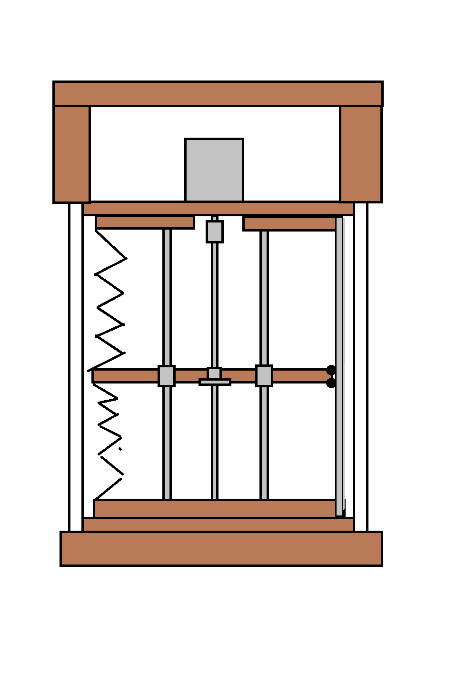
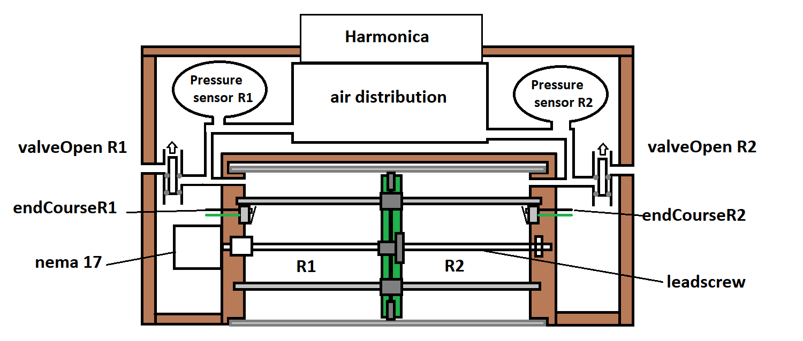
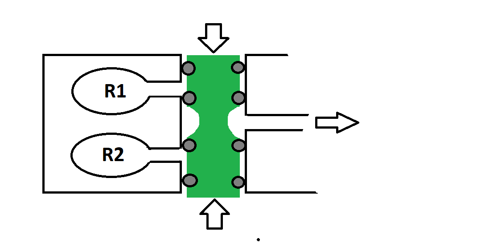

# harmonica_Midi

------------------------------------------------------------------------------------------------
---------------------     Le projet est encore au stade d'idée     -----------------------------
------------------------------------------------------------------------------------------------

## Introduction
Ce projet vise à créer un harminica électromécanique contrôlé via USB MIDI en utilisant un microcontrôleur Arduino, des cartes MCP9685, des transistors et des électroaimants ou des servomoteurs.
L'objectif est de créer un systeme electromecanique qui permet de jouer parfaitement les notes midi recue (via usb)

#### Les messages midi executé
Nous commencerons par implementer les messages midi classique tel que les messages NoteOn ou NoteOff sans prendre en compte la velocité de la note dans un premier temps .
Une fois la que l'ont peut correctement controller chacune des notes avec une velocité stable, la prochaine etape est d'ajouter le controle d'un "vibrato" en faisant varier la pression ou depression du reservoir utilisé.

## Choix technique
en utilisant les pression d'air d'air d'un etre humain, on pêut estimer l'aspiration de -0.1 a -0.5KPa et le soufflage de 0.1 a 0.5KPa

#### Systeme de pompes
Nous utiliserons un moteur pas a pas pour faire varier le volume de deux reservoirs et utiliser l'aspiration ou le soufflage pour les notes midi demandées.
chacun des deux reservoir devras avoir :
- un volume d'air deplacé d'environ 2 a 5 litres
- un capteur de pression
- un capteur fin de course (optique?) 
- un passage d'air vers la distribution/electrovannes
- un systeme de valve de securité pour pression ou vide trop important 
- une electrovanne pour controller l'ouverture du reservoir 
  

Les reservoirs pourons etre fait avec des systeme de soufflets ou avec un tube (transparent?) et des systemes de joints torique ou plat adapté.

il faut prendre en compte plusieurs parametres pour definir le debit maximum que l'ont peut atteindre :
-  Le pas de la tige fileté qui entraine le piston
-  la vitesse maximum du moteur (avec un couple suffisant)
-  les pertes/fuites

Le plus simple serait d'utiliser un tube de diametre 20cm et d'une hauteur de 35cm environ afin d'avoir autour de 10 litres d'airs dans les reservoirs.
il faut choisir le moteur et la tige fileté pour avoir un debit maximum de 10 a 15 litres par minutes =>  une tige fileté normale devrais sufire ? 
pour eviter les fuites nous pouvons utiliser des joints toriques pour sceller les assemblages.
On peut utiliser un joint plat decoupé pour isoler les deux reservoirs (il est egalement possible d'utiliser le joint comme "valve" de securité ; en jouant sur de design du piston, on peut utiliser le joint comme soupape de securité => pas cool pour le jeu avec les varaiation de presions)

L'ideal serait d'utiliser des assemblage de planches collé pour permettre le passage d'air et de l'electronique (ca a plus de gueule aussi)

#### Distribution

il est possible d'utiliser des electrovanne du marché mais cela va enormement augmenter le coup total
l'idée est d'imprimer un systeme de valve avec 2 entrées et une sortie pour chacun des trous de l'harmonica afin de selectionner l'aspiration ou le soufflage en fonction de la note midi demandé.

il faut respecter des contraintes de taille pour chaque passage d'air.
pour chaque trous vers l'harmonica, il faudrait utiliser une surface de 7 a 15 mm² ( soit un diametre de 3 a 4.5mm) 
pour chaque arrivé d'air, il faut adapter le diametre en fonction du nombre de note jouable en meme temps ( a adapter en fonction de la vitesse de deplacement de la partie centrale du reservoir) un diametre de 10 a 15mm devrais etre amplement sufisant pour un harmonica classique de 10 trous

## Schéma electrique

## liens utiles

