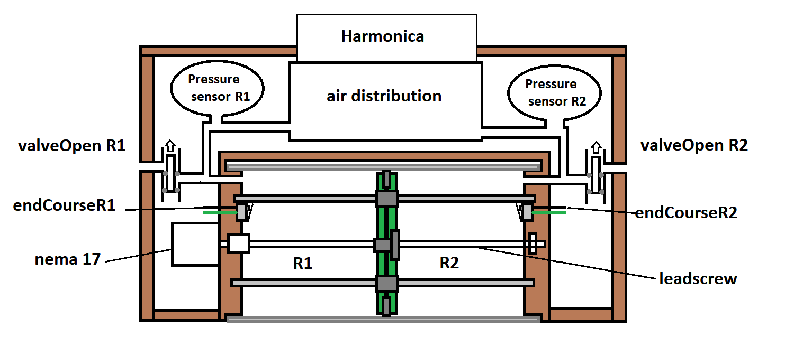
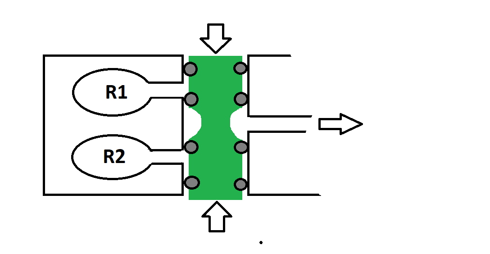

> [!NOTE]
> c'est juste une idée !

> [!TIP]
> Un **firmware modulaire pour ESP32**, entièrement configurable depuis une page
> web, a été ajouté. Il couvre :
>
> | | Options disponibles |
> |---|---|
> | **Systèmes d'air** | vérin double (2 réservoirs + piston) · soufflet simple · **2 pompes continues opposées** · **1 pompe + aiguillage** |
> | **Distribution** | servo 2 entrées→1 sortie · servo ouvert/fermé · **2 électro-vannes par trou** · **1 électro-vanne par trou** |
> | **Harmonicas** | diatonique Richter (toutes tonalités, **bends** inclus) · chromatique 12/16 trous avec slide · trémolo · octave · n'importe quel mapping sur 24 trous |
> | **Slide** | servo · électroaimant |
> | **MIDI** | DIN/UART filaire · BLE-MIDI · WiFi RTP-MIDI (AppleMIDI) · CC1 vibrato, CC2/CC7/CC11 intensité, pitch-bend |
> | **Pompes** | PWM MOSFET (LEDC) · ESC brushless · canal PCA9685 |
>
> Rien n'est codé en dur : le montage **et** l'instrument se décrivent dans
> `config.json`, éditable depuis la page web (9 onglets, éditeur de mapping,
> générateur de tonalités, presets, banc d'essai trou par trou).
> Voir **[`docs/architecture_fr.md`](docs/architecture_fr.md)**.
>
> Build : `pio run -e esp32dev` · Envoi de la page + config : `pio run -e esp32dev -t uploadfs`
> · Contrôles complets sur PC (tests, UI, syntaxe ESP32) : `./tools/run_native_tests.sh`.

------------------------------------------------------------------------------------------------

## Introduction
Ce projet vise à créer un harminica électromécanique contrôlé via USB MIDI en utilisant un microcontrôleur Arduino, des cartes MCP9685, des transistors et des électroaimants ou des servomoteurs.
L'objectif est de créer un systeme electromecanique qui permet de jouer parfaitement les notes midi recue (via usb)

#### Les messages midi executé

Nous commencerons par implementer les messages midi classique tel que les messages NoteOn ou NoteOff sans prendre en compte la velocité de la note dans un premier temps .
La seconde etape est d'ajouter la gestion de la velocité puis du volume.

On pourra ajouter facilement la gestion d'autre type demessage midi :
- Modulation (CC 1) : Utile pour simuler des effets comme le vibrato naturel de l'harmonica
- Breath Control (CC 2) : Modifie la dynamique ou l'intensité du son en fonction de la force du souffle.
- Expression (CC 11) : Permet des transitions fluides entre différentes dynamiques de jeu.
- Portamento (CC 5) : Ppour simuler des glissandos et des bends naturels dans le jeu d'un instrument à vent.

## Choix technique
en utilisant les pression d'air d'air d'un etre humain, on pêut estimer l'aspiration de -0.1 a -0.5KPa et le soufflage de 0.1 a 0.5KPa.

## Systeme de pompes

> Le firmware gère **quatre** systèmes d'air interchangeables (choix dans la page
> web, section « Air ») : le vérin double décrit ci-dessous, un soufflet simple,
> **deux pompes continues opposées** (souffle et aspiration disponibles en même
> temps, sans butée ni homing) et **une pompe unique + aiguillage** (le montage le
> plus économique, une seule direction à la fois). Le compromis de chacun est
> détaillé dans [`docs/architecture_fr.md`](docs/architecture_fr.md#3-le-vocabulaire-clé--direction-vs-rail).

Le plus simple serait d'utiliser un tube de diametre 20cm et d'une hauteur de 35cm environ afin d'avoir autour de 10 litres d'airs dans les reservoirs.
il faut choisir le moteur et la tige fileté pour avoir un debit maximum de 10 a 15 litres par minutes =>  une tige fileté normale devrais sufire ? 
pour eviter les fuites nous pouvons utiliser des joints toriques pour sceller les assemblages.
On peut utiliser un joint plat decoupé pour isoler les deux reservoirs.
En jouant sur de design du piston, on peut utiliser le joint comme soupape de securité (avec un joint plat suffisament epais) 

l'idée est d'utiliser le moteur pas a pas pour alterner l'aspiration et le soufflage sur les deux reservoirs en fonction de la postion du piston.
idealement il ne faut pas utiliser les fin de courses, l'idée est d'initialiser la position du piston sur l'un des deux coté au demarage puis de centrer le piston sans jouer de note (=> donc les deux valves open R1 et R2 ouverte) 
le code viendra alterner le sens de deplacement du piston en fonction de la distance restante des reservoir R1 et R2, l'objectif est de rester au centre le plus possible (l'harmonica jouant des melodies alternant le soufflage et l'aspiration, on evite donc trop d'utilisation des valves de distribution par la meme occasion )

## Distribution

> Les deux approches sont implémentées : **servos** (valve imprimée 2-en-1 ou
> porte 1-en-1) et **électro-vannes** (2 par trou pour choisir le rail, ou 1 par
> trou). Les électro-vannes commutent en 5–15 ms contre 50–150 ms pour un servo —
> c'est le montage à choisir pour des traits rapides — et le firmware gère leur
> maintien en « peak & hold » pour éviter la surchauffe.

il est possible d'utiliser des electrovanne du marché mais cela va enormement augmenter le coup total  
l'idée est d'imprimer un systeme de valve avec 2 entrées et une sortie pour chacun des trous de l'harmonica afin de selectionner l'aspiration ou le soufflage en fonction de la note midi demandé.

Le deplacement de chaque valve sera fait avec un servomoteur.  
  
il faut respecter des contraintes de taille pour chaque passage d'air :
- pour chaque trous vers l'harmonica, il faudrait utiliser une surface de 7 a 15 mm² ( soit un diametre de 3 a 4.5mm) 
- pour chaque arrivé d'air, il faut adapter le diametre en fonction du nombre de note jouable en meme temps ( a adapter en fonction de la vitesse de deplacement de la partie centrale du reservoir) un diametre de 10 a 15mm devrais etre amplement sufisant pour un harmonica classique de 10 trous

## Materiel electrique

- un nema 17 
- un driver pour moteur pas a pas (idealement un pour deplacement silencieux  comme le DRV8825 ou TMC2208 ) 
- deux fin de course mecanique (le second est la par securité dans le cas ou il y aurait une perte de pas )
- deux capteurs de pression adapté pour chaque coté ( BMP180/BMP280  ou MPX2010 )
- un pca9685
- 12 servomoteurs (1 pour chaque trou d'harmonica et 2 pour les valves d'ouverture des reservoirs)
- alimentation 12v et 5v adapté
- arduino ou autre microcontroleur

Variantes prises en charge par le firmware (voir la page web, section « Air » et
« Distribution ») :

- **électro-vannes au lieu des servos** : un 2ᵉ PCA9685 (`0x41`) en tout-ou-rien ou
  des GPIO, dans les deux cas derrière un driver de puissance (ULN2803 / MOSFET +
  diode de roue libre) ;
- **pompes au lieu du pas-à-pas** : une ou deux pompes/turbines pilotées en PWM
  (MOSFET sur une sortie LEDC) ou par ESC brushless — plus de moteur pas-à-pas,
  plus de fins de course, plus de perte de pas ;
- **capteur de pression** : BMP280 (I2C) ou MPX2010 (analogique) ; un seul capteur
  suffit en mode « symétrique » sur le montage à deux pompes.

## Schéma electrique

Le schéma détaillé reste à produire. En attendant, le **brochage complet** (ESP32,
PCA9685, driver pas-à-pas, capteurs de pression, fins de course, entrée MIDI DIN)
est documenté dans la section brochage de
[`docs/architecture_fr.md`](docs/architecture_fr.md#8-ressources-esp32-classique--brochage).

